# HlpAI - Library Mode Documentation

> **.NET library for third-party integration and custom application development**

The Library Mode enables developers to integrate HlpAI's document intelligence capabilities directly into their own .NET applications. This provides clean, type-safe APIs for document processing, AI interaction, RAG functionality, and MCP server capabilities that can be seamlessly incorporated into existing codebases.

## 🎯 Overview

**Library Mode** is designed for:
- ✅ **.NET application developers** who want to add document intelligence to their projects
- ✅ **Enterprise solutions** requiring customized document processing workflows
- ✅ **Microservices architecture** where HlpAI capabilities are embedded within services
- ✅ **Custom UI applications** that need integrated AI and document search features
- ✅ **Automation systems** requiring programmatic access to document intelligence

## 🚀 Getting Started

### Installation

#### Package Reference (Recommended)
Add the HlpAI package reference to your `.csproj` file:

```xml
<PackageReference Include="HlpAI" Version="1.0.0" />
```

#### Project Reference (Development)
For development or local modifications, add a project reference:

```xml
<ProjectReference Include="..\HlpAI\HlpAI.csproj" />
```

#### NuGet Package Manager
```bash
# Package Manager Console
Install-Package HlpAI

# .NET CLI
dotnet add package HlpAI

# PackageReference in CSPROJ
<PackageReference Include="HlpAI" Version="1.0.0" />
```

### Basic Setup

#### Minimal API Example
```csharp
using HlpAI;
using HlpAI.Models;
using HlpAI.Services;
using Microsoft.Extensions.DependencyInjection;

var builder = WebApplication.CreateBuilder(args);

// Add HlpAI services
builder.Services.AddHlpAI(options =>
{
    options.DocumentDirectory = "C:\\YourDocuments";
    options.ModelName = "llama3.2";
    options.OperationMode = OperationMode.Hybrid;
    options.EnableRag = true;
});

var app = builder.Build();

// Basic health check
app.MapGet("/", () => "HlpAI Library Integrated Successfully!");

app.Run();
```

#### Dependency Injection Configuration
```csharp
public void ConfigureServices(IServiceCollection services)
{
    // Add HlpAI with configuration
    services.AddHlpAI(Configuration.GetSection("HlpAI"));
    
    // Or configure manually
    services.AddHlpAI(options =>
    {
        options.DocumentDirectory = Configuration["DocumentDirectory"];
        options.ModelName = Configuration["ModelName"] ?? "llama3.2";
        options.OperationMode = Enum.Parse<OperationMode>(
            Configuration["OperationMode"] ?? "Hybrid");
        options.EnableRag = bool.Parse(Configuration["EnableRag"] ?? "true");
        options.MaxConcurrentOperations = 10;
    });
    
    // Add additional services
    services.AddControllers();
    services.AddSwaggerGen();
}
```

## 📋 Core API Reference

### Document Processing APIs

#### **IFileExtractorService**
Interface for file extraction and processing.

```csharp
public interface IFileExtractorService
{
    Task<FileExtractionResult> ExtractTextAsync(string filePath);
    Task<IEnumerable<FileInfo>> GetSupportedFilesAsync(string directoryPath);
    Task<FileAuditResult> AuditDirectoryAsync(string directoryPath);
    bool IsFileSupported(string filePath);
    void AddFileExtension(string extractorName, string extension);
    void RemoveFileExtension(string extractorName, string extension);
}
```

**Usage Example:**
```csharp
public class DocumentProcessor
{
    private readonly IFileExtractorService _extractorService;
    
    public DocumentProcessor(IFileExtractorService extractorService)
    {
        _extractorService = extractorService;
    }
    
    public async Task ProcessDocumentsAsync(string directoryPath)
    {
        // Audit directory first
        var auditResult = await _extractorService.AuditDirectoryAsync(directoryPath);
        Console.WriteLine($"Found {auditResult.TotalFiles} files, " +
                         $"{auditResult.IndexableFiles} indexable");
        
        // Process supported files
        var supportedFiles = await _extractorService.GetSupportedFilesAsync(directoryPath);
        foreach (var file in supportedFiles)
        {
            var extractionResult = await _extractorService.ExtractTextAsync(file.FullName);
            if (extractionResult.Success)
            {
                Console.WriteLine($"Processed {file.Name}: {extractionResult.Content.Length} characters");
            }
        }
    }
}
```

#### **IEmbeddingService**
Interface for text embedding and vector operations.

```csharp
public interface IEmbeddingService
{
    Task<float[]> GetEmbeddingAsync(string text);
    Task<float[][]> GetEmbeddingsAsync(IEnumerable<string> texts);
    Task<IEnumerable<SearchResult>> SearchAsync(string query, int topK = 5);
    Task<int> GetEmbeddingDimensionAsync();
}
```

**Usage Example:**
```csharp
public class SemanticSearchService
{
    private readonly IEmbeddingService _embeddingService;
    
    public SemanticSearchService(IEmbeddingService embeddingService)
    {
        _embeddingService = embeddingService;
    }
    
    public async Task<IEnumerable<SearchResult>> FindSimilarDocumentsAsync(
        string query, int maxResults = 5)
    {
        return await _embeddingService.SearchAsync(query, maxResults);
    }
    
    public async Task<float> CalculateSimilarityAsync(string text1, string text2)
    {
        var embedding1 = await _embeddingService.GetEmbeddingAsync(text1);
        var embedding2 = await _embeddingService.GetEmbeddingAsync(text2);
        
        // Calculate cosine similarity
        float dotProduct = 0;
        float magnitude1 = 0;
        float magnitude2 = 0;
        
        for (int i = 0; i < embedding1.Length; i++)
        {
            dotProduct += embedding1[i] * embedding2[i];
            magnitude1 += embedding1[i] * embedding1[i];
            magnitude2 += embedding2[i] * embedding2[i];
        }
        
        magnitude1 = (float)Math.Sqrt(magnitude1);
        magnitude2 = (float)Math.Sqrt(magnitude2);
        
        return dotProduct / (magnitude1 * magnitude2);
    }
}
```

### AI Interaction APIs

#### **IAiProvider**
Interface for AI model interaction.

```csharp
public interface IAiProvider
{
    string ProviderName { get; }
    bool IsAvailable { get; }
    
    Task<AiResponse> AskAsync(string question, 
        AiRequestOptions? options = null);
    
    Task<AiResponse> AnalyzeAsync(string content, 
        AnalysisType analysisType = AnalysisType.Summary,
        AiRequestOptions? options = null);
    
    Task<IEnumerable<ModelInfo>> GetAvailableModelsAsync();
    Task<bool> TestConnectionAsync();
}
```

**Usage Example:**
```csharp
public class AiAssistantService
{
    private readonly IAiProvider _aiProvider;
    
    public AiAssistantService(IAiProvider aiProvider)
    {
        _aiProvider = aiProvider;
    }
    
    public async Task<string> GetAnswerAsync(string question, 
        double temperature = 0.7, bool useRag = true)
    {
        var options = new AiRequestOptions
        {
            Temperature = temperature,
            UseRag = useRag,
            MaxTokens = 1000
        };
        
        var response = await _aiProvider.AskAsync(question, options);
        
        if (response.Success)
        {
            return response.Content;
        }
        else
        {
            throw new Exception($"AI request failed: {response.ErrorMessage}");
        }
    }
    
    public async Task<DocumentAnalysis> AnalyzeDocumentAsync(string content)
    {
        var response = await _aiProvider.AnalyzeAsync(
            content, AnalysisType.KeyPoints);
        
        return new DocumentAnalysis
        {
            KeyPoints = response.Content.Split('\n')
                .Where(line => !string.IsNullOrWhiteSpace(line))
                .ToList(),
            Summary = response.Metadata.GetValueOrDefault("summary", ""),
            Confidence = response.Confidence
        };
    }
}
```

#### **IRagService**
Interface for Retrieval-Augmented Generation.

```csharp
public interface IRagService
{
    Task<RagResponse> AskWithContextAsync(string question, 
        RagRequestOptions? options = null);
    
    Task<IEnumerable<ContextChunk>> RetrieveContextAsync(string query, 
        int topK = 5, double minSimilarity = 0.5);
    
    Task ReindexDocumentsAsync(bool force = false);
    Task<IndexingReport> GetIndexingReportAsync();
    Task<int> GetVectorCountAsync();
}
```

**Usage Example:**
```csharp
public class ResearchAssistant
{
    private readonly IRagService _ragService;
    
    public ResearchAssistant(IRagService ragService)
    {
        _ragService = ragService;
    }
    
    public async Task<ResearchResult> ResearchTopicAsync(string topic, 
        int contextChunks = 3, double temperature = 0.3)
    {
        var options = new RagRequestOptions
        {
            TopK = contextChunks,
            Temperature = temperature,
            IncludeSources = true
        };
        
        var response = await _ragService.AskWithContextAsync(topic, options);
        
        return new ResearchResult
        {
            Answer = response.Answer,
            Sources = response.Sources,
            Confidence = response.Confidence,
            ContextUsed = response.ContextChunks
        };
    }
    
    public async Task<IEnumerable<RelatedDocument>> FindRelatedDocumentsAsync(
        string concept, int maxDocuments = 5)
    {
        var contextChunks = await _ragService.RetrieveContextAsync(
            concept, maxDocuments * 2, 0.6);
        
        // Group by document and select top chunks per document
        var documents = contextChunks
            .GroupBy(c => c.DocumentName)
            .Select(g => new RelatedDocument
            {
                DocumentName = g.Key,
                RelevanceScore = g.Max(c => c.SimilarityScore),
                BestChunk = g.OrderByDescending(c => c.SimilarityScore).First(),
                TotalChunks = g.Count()
            })
            .OrderByDescending(d => d.RelevanceScore)
            .Take(maxDocuments);
        
        return documents;
    }
}
```

### MCP Server Integration

#### **IMcpServerService**
Interface for MCP server functionality.

```csharp
public interface IMcpServerService
{
    Task StartAsync(CancellationToken cancellationToken = default);
    Task StopAsync(CancellationToken cancellationToken = default);
    Task<McpResponse> HandleRequestAsync(McpRequest request);
    bool IsRunning { get; }
    event EventHandler<McpRequestEventArgs> RequestReceived;
    event EventHandler<McpResponseEventArgs> ResponseSent;
}
```

**Usage Example:**
```csharp
public class McpIntegrationService
{
    private readonly IMcpServerService _mcpServer;
    private readonly ILogger<McpIntegrationService> _logger;
    
    public McpIntegrationService(IMcpServerService mcpServer, 
        ILogger<McpIntegrationService> logger)
    {
        _mcpServer = mcpServer;
        _logger = logger;
        
        // Subscribe to events
        _mcpServer.RequestReceived += OnRequestReceived;
        _mcpServer.ResponseSent += OnResponseSent;
    }
    
    public async Task StartServerAsync()
    {
        await _mcpServer.StartAsync();
        _logger.LogInformation("MCP server started successfully");
    }
    
    public async Task<string> ProcessRequestAsync(string method, object parameters)
    {
        var request = new McpRequest
        {
            JsonRpc = "2.0",
            Id = Guid.NewGuid().ToString(),
            Method = method,
            Params = parameters
        };
        
        var response = await _mcpServer.HandleRequestAsync(request);
        
        if (response.Error != null)
        {
            throw new Exception($"MCP error: {response.Error.Message}");
        }
        
        return response.Result?.ToString() ?? string.Empty;
    }
    
    private void OnRequestReceived(object sender, McpRequestEventArgs e)
    {
        _logger.LogDebug("MCP request received: {Method}", e.Request.Method);
    }
    
    private void OnResponseSent(object sender, McpResponseEventArgs e)
    {
        _logger.LogDebug("MCP response sent for: {Method}", e.Request.Method);
    }
}
```

## 🏗️ Architecture & Design Patterns

### Service Architecture

```mermaid
graph TB
    A[📁 Your Application] --> B[🎯 HlpAI Library]
    
    B --> C[🔧 FileExtractorService]
    B --> D[🧠 EmbeddingService] 
    B --> E[🤖 AiProviderService]
    B --> F[🔍 RagService]
    B --> G[🖥️ McpServerService]
    
    C --> H[📝 Text Processing]
    D --> I[🗄️ Vector Store]
    E --> J[🎯 AI Models]
    F --> I
    F --> J
    G --> C
    G --> E
    G --> F
    
    H --> K[📄 Document Files]
    I --> L[💾 SQLite Database]
    J --> M[🌐 AI Providers Ollama/LM Studio/Open WebUI]
```



### Dependency Injection Setup

**Comprehensive DI Configuration:**
```csharp
public static class ServiceCollectionExtensions
{
    public static IServiceCollection AddHlpAI(
        this IServiceCollection services, 
        IConfiguration configuration)
    {
        // Register options
        services.Configure<HlpAIOptions>(configuration);
        
        // Register core services
        services.AddSingleton<IFileExtractorService, FileExtractorService>();
        services.AddSingleton<IEmbeddingService, EmbeddingService>();
        services.AddSingleton<IAiProviderFactory, AiProviderFactory>();
        services.AddSingleton<IRagService, RagService>();
        services.AddSingleton<IMcpServerService, McpServerService>();
        
        // Register provider-specific services
        services.AddSingleton<IOllamaClient, OllamaClient>();
        services.AddSingleton<ILmStudioClient, LmStudioClient>();
        services.AddSingleton<IOpenWebUiClient, OpenWebUiClient>();
        
        // Register supporting services
        services.AddSingleton<IConfigurationService, SqliteConfigurationService>();
        services.AddSingleton<IErrorLoggingService, ErrorLoggingService>();
        services.AddSingleton<IPromptService, PromptService>();
        
        // Register hosted services
        services.AddHostedService<InitializationService>();
        
        return services;
    }
}
```

### Configuration Model

**HlpAIOptions Class:**
```csharp
public class HlpAIOptions
{
    public required string DocumentDirectory { get; set; }
    public string ModelName { get; set; } = "llama3.2";
    public OperationMode OperationMode { get; set; } = OperationMode.Hybrid;
    public bool EnableRag { get; set; } = true;
    public string? EmbeddingModel { get; set; }
    
    // Performance settings
    public int MaxConcurrentOperations { get; set; } = 10;
    public int ChunkSize { get; set; } = 1000;
    public int ChunkOverlap { get; set; } = 200;
    public long MaxFileSize { get; set; } = 100 * 1024 * 1024; // 100MB
    
    // AI provider settings
    public Dictionary<string, string> ProviderUrls { get; set; } = new()
    {
        ["Ollama"] = "http://localhost:11434",
        ["LMStudio"] = "http://localhost:1234",
        ["OpenWebUI"] = "http://localhost:3000"
    };
    
    // Logging settings
    public LogLevel LogLevel { get; set; } = LogLevel.Information;
    public bool EnableDetailedLogging { get; set; } = false;
    
    // Advanced settings
    public TimeSpan RequestTimeout { get; set; } = TimeSpan.FromMinutes(2);
    public int MaxRetryAttempts { get; set; } = 3;
    public bool EnableCaching { get; set; } = true;
    public TimeSpan CacheDuration { get; set; } = TimeSpan.FromHours(1);
}
```

## 🔧 Advanced Usage Examples

### Custom File Extractor Implementation

**Creating a Custom Extractor:**
```csharp
public class CustomFileExtractor : IFileExtractor
{
    public string Name => "custom";
    public string Description => "Custom file extractor for specialized formats";
    public string[] SupportedExtensions => new[] { ".custom", ".special" };
    
    public async Task<FileExtractionResult> ExtractTextAsync(string filePath)
    {
        try
        {
            // Custom extraction logic
            var content = await File.ReadAllTextAsync(filePath);
            
            // Custom processing
            content = ProcessCustomFormat(content);
            
            return new FileExtractionResult
            {
                Success = true,
                Content = content,
                Metadata = new Dictionary<string, object>
                {
                    ["fileSize"] = new FileInfo(filePath).Length,
                    ["processedAt"] = DateTime.UtcNow
                }
            };
        }
        catch (Exception ex)
        {
            return new FileExtractionResult
            {
                Success = false,
                ErrorMessage = ex.Message
            };
        }
    }
    
    private string ProcessCustomFormat(string content)
    {
        // Custom format processing logic
        return content.Replace("{{timestamp}}", DateTime.UtcNow.ToString())
                     .Replace("{{version}}", "1.0.0");
    }
}

// Registration
services.AddSingleton<IFileExtractor, CustomFileExtractor>();
```

### Advanced RAG Configuration

**Custom RAG Pipeline:**
```csharp
public class AdvancedRagService : IRagService
{
    private readonly IEmbeddingService _embeddingService;
    private readonly IAiProvider _aiProvider;
    private readonly ILogger<AdvancedRagService> _logger;
    
    public AdvancedRagService(IEmbeddingService embeddingService, 
        IAiProvider aiProvider, ILogger<AdvancedRagService> logger)
    {
        _embeddingService = embeddingService;
        _aiProvider = aiProvider;
        _logger = logger;
    }
    
    public async Task<RagResponse> AskWithContextAsync(string question, 
        RagRequestOptions? options = null)
    {
        options ??= new RagRequestOptions();
        
        try
        {
            // Step 1: Retrieve relevant context
            var contextChunks = await RetrieveContextAsync(question, 
                options.TopK, options.MinSimilarity);
            
            // Step 2: Enhance context with additional processing
            var enhancedContext = await EnhanceContextAsync(contextChunks, question);
            
            // Step 3: Generate AI response with enhanced context
            var response = await _aiProvider.AskAsync(question, new AiRequestOptions
            {
                Temperature = options.Temperature,
                Context = enhancedContext,
                MaxTokens = options.MaxTokens
            });
            
            return new RagResponse
            {
                Success = response.Success,
                Answer = response.Content,
                Confidence = response.Confidence,
                ContextChunks = contextChunks,
                Metadata = response.Metadata
            };
        }
        catch (Exception ex)
        {
            _logger.LogError(ex, "RAG processing failed for question: {Question}", question);
            return new RagResponse
            {
                Success = false,
                ErrorMessage = ex.Message
            };
        }
    }
    
    private async Task<string> EnhanceContextAsync(
        IEnumerable<ContextChunk> contextChunks, string question)
    {
        // Custom context enhancement logic
        var enhancedContext = new StringBuilder();
        
        foreach (var chunk in contextChunks.OrderByDescending(c => c.SimilarityScore))
        {
            enhancedContext.AppendLine($"📄 From {chunk.DocumentName} (relevance: {chunk.SimilarityScore:P0}):");
            enhancedContext.AppendLine(chunk.Content);
            enhancedContext.AppendLine();
        }
        
        // Add question analysis
        enhancedContext.AppendLine($"🎯 Question analysis: {question}");
        enhancedContext.AppendLine($"📊 Context chunks used: {contextChunks.Count()}");
        
        return enhancedContext.ToString();
    }
    
    // Implement other IRagService methods...
}
```

### Real-time Document Processing

**Background Document Processor:**
```csharp
public class RealTimeDocumentProcessor : BackgroundService
{
    private readonly IFileExtractorService _extractorService;
    private readonly IEmbeddingService _embeddingService;
    private readonly ILogger<RealTimeDocumentProcessor> _logger;
    private readonly FileSystemWatcher _fileWatcher;
    
    public RealTimeDocumentProcessor(IFileExtractorService extractorService,
        IEmbeddingService embeddingService, ILogger<RealTimeDocumentProcessor> logger)
    {
        _extractorService = extractorService;
        _embeddingService = embeddingService;
        _logger = logger;
        
        _fileWatcher = new FileSystemWatcher
        {
            Path = "C:\\YourDocuments",
            NotifyFilter = NotifyFilters.LastWrite | NotifyFilters.FileName,
            Filter = "*.*",
            EnableRaisingEvents = true
        };
    }
    
    protected override async Task ExecuteAsync(CancellationToken stoppingToken)
    {
        _fileWatcher.Created += async (sender, e) => 
            await ProcessFileAsync(e.FullPath, stoppingToken);
        _fileWatcher.Changed += async (sender, e) => 
            await ProcessFileAsync(e.FullPath, stoppingToken);
        
        while (!stoppingToken.IsCancellationRequested)
        {
            await Task.Delay(1000, stoppingToken);
        }
    }
    
    private async Task ProcessFileAsync(string filePath, CancellationToken cancellationToken)
    {
        try
        {
            if (!_extractorService.IsFileSupported(filePath))
                return;
            
            _logger.LogInformation("Processing file: {FilePath}", filePath);
            
            // Extract text
            var extractionResult = await _extractorService.ExtractTextAsync(filePath);
            if (!extractionResult.Success)
                return;
            
            // Generate embeddings
            var embedding = await _embeddingService.GetEmbeddingAsync(extractionResult.Content);
            
            _logger.LogInformation("File processed successfully: {FilePath}, " +
                "embedding size: {EmbeddingSize}", filePath, embedding.Length);
        }
        catch (Exception ex)
        {
            _logger.LogError(ex, "Error processing file: {FilePath}", filePath);
        }
    }
    
    public override void Dispose()
    {
        _fileWatcher?.Dispose();
        base.Dispose();
    }
}
```

## 🚀 Integration Examples

### ASP.NET Core Web API Integration

**Document Search API:**
```csharp
[ApiController]
[Route("api/documents")]
public class DocumentsController : ControllerBase
{
    private readonly IEmbeddingService _embeddingService;
    private readonly IFileExtractorService _extractorService;
    
    public DocumentsController(IEmbeddingService embeddingService, 
        IFileExtractorService extractorService)
    {
        _embeddingService = embeddingService;
        _extractorService = extractorService;
    }
    
    [HttpGet("search")]
    public async Task<IActionResult> Search([FromQuery] string query, 
        [FromQuery] int maxResults = 10)
    {
        try
        {
            var results = await _embeddingService.SearchAsync(query, maxResults);
            return Ok(new { results, query, total = results.Count() });
        }
        catch (Exception ex)
        {
            return StatusCode(500, new { error = ex.Message });
        }
    }
    
    [HttpGet("audit")]
    public async Task<IActionResult> Audit([FromQuery] string directory)
    {
        try
        {
            var auditResult = await _extractorService.AuditDirectoryAsync(directory);
            return Ok(auditResult);
        }
        catch (Exception ex)
        {
            return StatusCode(500, new { error = ex.Message });
        }
    }
    
    [HttpPost("analyze")]
    public async Task<IActionResult> Analyze([FromBody] AnalyzeRequest request)
    {
        try
        {
            if (!_extractorService.IsFileSupported(request.FilePath))
                return BadRequest(new { error = "Unsupported file type" });
            
            var extractionResult = await _extractorService.ExtractTextAsync(request.FilePath);
            if (!extractionResult.Success)
                return BadRequest(new { error = extractionResult.ErrorMessage });
            
            // Use AI to analyze content
            var aiResponse = await _aiProvider.AnalyzeAsync(
                extractionResult.Content, request.AnalysisType);
            
            return Ok(new 
            {
                analysis = aiResponse.Content,
                confidence = aiResponse.Confidence,
                metadata = aiResponse.Metadata
            });
        }
        catch (Exception ex)
        {
            return StatusCode(500, new { error = ex.Message });
        }
    }
}

public record AnalyzeRequest(string FilePath, AnalysisType AnalysisType);
```

### Blazor WebAssembly Integration

**Blazor Document Search Component:**
```razor
@using HlpAI.Models
@inject IEmbeddingService EmbeddingService
@inject IJSRuntime JSRuntime

<div class="document-search">
    <h3>Document Search</h3>
    
    <div class="search-box">
        <input @bind="SearchQuery" @bind:event="oninput" 
               placeholder="Search documents..." class="form-control" />
        <button @onclick="Search" class="btn btn-primary" 
                disabled="@IsSearching">Search</button>
    </div>
    
    @if (IsSearching)
    {
        <div class="searching">Searching...</div>
    }
    
    @if (SearchResults != null)
    {
        <div class="results">
            <h4>Results (@SearchResults.Count() found)</h4>
            
            @foreach (var result in SearchResults)
            {
                <div class="result-item">
                    <h5>@result.FileName</h5>
                    <div class="similarity">Similarity: @(result.SimilarityScore.ToString("P1"))</div>
                    <div class="snippet">@result.Snippet</div>
                    <button @onclick="() => ViewDocument(result)" 
                            class="btn btn-sm btn-outline-primary">
                        View Document
                    </button>
                </div>
            }
        </div>
    }
</div>

@code {
    private string SearchQuery { get; set; } = "";
    private IEnumerable<SearchResult> SearchResults { get; set; }
    private bool IsSearching { get; set; }
    
    private async Task Search()
    {
        if (string.IsNullOrWhiteSpace(SearchQuery))
            return;
            
        IsSearching = true;
        try
        {
            SearchResults = await EmbeddingService.SearchAsync(SearchQuery, 10);
        }
        catch (Exception ex)
        {
            await JSRuntime.InvokeVoidAsync("console.error", ex.Message);
        }
        finally
        {
            IsSearching = false;
        }
    }
    
    private void ViewDocument(SearchResult result)
    {
        // Navigate to document view
        NavigationManager.NavigateTo($"/documents/{Uri.EscapeDataString(result.FileName)}");
    }
}
```

### Windows Service Integration

**Document Processing Windows Service:**
```csharp
public class DocumentProcessingService : BackgroundService
{
    private readonly IFileExtractorService _extractorService;
    private readonly IEmbeddingService _embeddingService;
    private readonly IRagService _ragService;
    private readonly ILogger<DocumentProcessingService> _logger;
    
    public DocumentProcessingService(IFileExtractorService extractorService,
        IEmbeddingService embeddingService, IRagService ragService,
        ILogger<DocumentProcessingService> logger)
    {
        _extractorService = extractorService;
        _embeddingService = embeddingService;
        _ragService = ragService;
        _logger = logger;
    }
    
    protected override async Task ExecuteAsync(CancellationToken stoppingToken)
    {
        _logger.LogInformation("Document Processing Service started");
        
        while (!stoppingToken.IsCancellationRequested)
        {
            try
            {
                await ProcessPendingDocumentsAsync(stoppingToken);
                await Task.Delay(TimeSpan.FromMinutes(5), stoppingToken);
            }
            catch (Exception ex) when (stoppingToken.IsCancellationRequested)
            {
                _logger.LogInformation("Service stopping");
                break;
            }
            catch (Exception ex)
            {
                _logger.LogError(ex, "Error in document processing loop");
                await Task.Delay(TimeSpan.FromMinutes(1), stoppingToken);
            }
        }
    }
    
    private async Task ProcessPendingDocumentsAsync(CancellationToken cancellationToken)
    {
        var auditResult = await _extractorService.AuditDirectoryAsync("C:\\YourDocuments");
        
        foreach (var file in auditResult.SupportedFiles)
        {
            if (cancellationToken.IsCancellationRequested)
                break;
                
            try
            {
                var extractionResult = await _extractorService.ExtractTextAsync(file.FullName);
                if (extractionResult.Success)
                {
                    await _embeddingService.GetEmbeddingAsync(extractionResult.Content);
                    _logger.LogInformation("Processed: {FileName}", file.Name);
                }
            }
            catch (Exception ex)
            {
                _logger.LogWarning(ex, "Failed to process: {FileName}", file.Name);
            }
        }
    }
}
```

## 📊 Performance Optimization

### Memory Management

**Optimized Embedding Service:**
```csharp
public class OptimizedEmbeddingService : IEmbeddingService
{
    private readonly IOllamaClient _ollamaClient;
    private readonly IMemoryCache _memoryCache;
    private readonly ILogger<OptimizedEmbeddingService> _logger;
    
    public OptimizedEmbeddingService(IOllamaClient ollamaClient,
        IMemoryCache memoryCache, ILogger<OptimizedEmbeddingService> logger)
    {
        _ollamaClient = ollamaClient;
        _memoryCache = memoryCache;
        _logger = logger;
    }
    
    public async Task<float[]> GetEmbeddingAsync(string text)
    {
        // Cache embeddings to avoid redundant computations
        var cacheKey = $"embedding_{GetHash(text)}";
        
        if (_memoryCache.TryGetValue(cacheKey, out float[] cachedEmbedding))
        {
            _logger.LogDebug("Cache hit for text: {TextHash}", GetHash(text));
            return cachedEmbedding;
        }
        
        var embedding = await _ollamaClient.GetEmbeddingAsync(text);
        
        // Cache for 1 hour
        _memoryCache.Set(cacheKey, embedding, TimeSpan.FromHours(1));
        
        return embedding;
    }
    
    public async Task<float[][]> GetEmbeddingsAsync(IEnumerable<string> texts)
    {
        // Batch processing for better performance
        var batchSize = 10;
        var results = new List<float[]>();
        var textList = texts.ToList();
        
        for (int i = 0; i < textList.Count; i += batchSize)
        {
            var batch = textList.Skip(i).Take(batchSize).ToArray();
            var batchEmbeddings = await ProcessBatchAsync(batch);
            results.AddRange(batchEmbeddings);
        }
        
        return results.ToArray();
    }
    
    private async Task<float[][]> ProcessBatchAsync(string[] texts)
    {
        // Implement batch processing logic
        var tasks = texts.Select(text => GetEmbeddingAsync(text)).ToArray();
        return await Task.WhenAll(tasks);
    }
    
    private static string GetHash(string input)
    {
        using var sha256 = SHA256.Create();
        var hash = sha256.ComputeHash(Encoding.UTF8.GetBytes(input));
        return Convert.ToBase64String(hash);
    }
}
```

### Database Optimization

**SQLite Vector Store Optimization:**
```csharp
public class OptimizedVectorStore : IVectorStore
{
    private readonly SQLiteConnection _connection;
    private readonly ILogger<OptimizedVectorStore> _logger;
    
    public OptimizedVectorStore(ILogger<OptimizedVectorStore> logger)
    {
        _logger = logger;
        _connection = new SQLiteConnection("Data Source=vectors.db");
        _connection.Open();
        InitializeDatabase();
    }
    
    private void InitializeDatabase()
    {
        // Create optimized tables with indexes
        using var command = _connection.CreateCommand();
        command.CommandText = @"
            CREATE TABLE IF NOT EXISTS vectors (
                id INTEGER PRIMARY KEY AUTOINCREMENT,
                document_id TEXT NOT NULL,
                chunk_index INTEGER NOT NULL,
                embedding BLOB NOT NULL,
                content TEXT NOT NULL,
                created_at DATETIME DEFAULT CURRENT_TIMESTAMP,
                UNIQUE(document_id, chunk_index)
            );
            
            CREATE INDEX IF NOT EXISTS idx_vectors_document ON vectors(document_id);
            CREATE INDEX IF NOT EXISTS idx_vectors_created ON vectors(created_at);
            
            CREATE VIRTUAL TABLE IF NOT EXISTS vectors_fts USING fts5(
                content,
                content='vectors',
                content_rowid='id'
            );
        ";
        command.ExecuteNonQuery();
    }
    
    public async Task StoreVectorsAsync(IEnumerable<VectorData> vectors)
    {
        using var transaction = _connection.BeginTransaction();
        
        try
        {
            foreach (var vector in vectors)
            {
                using var command = _connection.CreateCommand();
                command.CommandText = @"
                    INSERT OR REPLACE INTO vectors 
                    (document_id, chunk_index, embedding, content)
                    VALUES (@documentId, @chunkIndex, @embedding, @content)
                ";
                
                command.Parameters.AddWithValue("@documentId", vector.DocumentId);
                command.Parameters.AddWithValue("@chunkIndex", vector.ChunkIndex);
                command.Parameters.AddWithValue("@embedding", vector.Embedding);
                command.Parameters.AddWithValue("@content", vector.Content);
                
                await command.ExecuteNonQueryAsync();
            }
            
            transaction.Commit();
        }
        catch
        {
            transaction.Rollback();
            throw;
        }
    }
    
    public async Task<IEnumerable<VectorData>> SearchVectorsAsync(float[] queryEmbedding, 
        int topK = 5, double minSimilarity = 0.5)
    {
        using var command = _connection.CreateCommand();
        command.CommandText = @"
            SELECT document_id, chunk_index, embedding, content,
                   cosine_similarity(embedding, @queryEmbedding) as similarity
            FROM vectors
            WHERE cosine_similarity(embedding, @queryEmbedding) >= @minSimilarity
            ORDER BY similarity DESC
            LIMIT @topK
        ";
        
        command.Parameters.AddWithValue("@queryEmbedding", queryEmbedding);
        command.Parameters.AddWithValue("@minSimilarity", minSimilarity);
        command.Parameters.AddWithValue("@topK", topK);
        
        var results = new List<VectorData>();
        using var reader = await command.ExecuteReaderAsync();
        
        while (await reader.ReadAsync())
        {
            results.Add(new VectorData
            {
                DocumentId = reader.GetString(0),
                ChunkIndex = reader.GetInt32(1),
                Embedding = (float[])reader.GetValue(2),
                Content = reader.GetString(3),
                SimilarityScore = reader.GetDouble(4)
            });
        }
        
        return results;
    }
}

// Register optimized service
services.AddSingleton<IVectorStore, OptimizedVectorStore>();
```

## 🚀 Deployment Strategies

### Docker Containerization

**Dockerfile for Library Integration:**
```dockerfile
FROM mcr.microsoft.com/dotnet/aspnet:9.0 AS base
WORKDIR /app
EXPOSE 80
EXPOSE 443

FROM mcr.microsoft.com/dotnet/sdk:9.0 AS build
WORKDIR /src
COPY ["YourApp/YourApp.csproj", "YourApp/"]
COPY ["HlpAI/HlpAI.csproj", "HlpAI/"]
RUN dotnet restore "YourApp/YourApp.csproj"
COPY . .
WORKDIR "/src/YourApp"
RUN dotnet build "YourApp.csproj" -c Release -o /app/build

FROM build AS publish
RUN dotnet publish "YourApp.csproj" -c Release -o /app/publish

FROM base AS final
WORKDIR /app
COPY --from=publish /app/publish .
COPY --from=build /src/HlpAI/vector-models/ /app/vector-models/
VOLUME /documents
ENTRYPOINT ["dotnet", "YourApp.dll"]
```

**Docker Compose Configuration:**
```yaml
version: '3.8'

services:
  yourapp:
    build: .
    ports:
      - "8080:80"
      - "8081:443"
    volumes:
      - documents:/app/documents
      - models:/app/models
    environment:
      - DocumentDirectory=/app/documents
      - ModelName=llama3.2
      - OperationMode=Hybrid
      - EnableRag=true
    depends_on:
      - ollama

  ollama:
    image: ollama/ollama:latest
    ports:
      - "11434:11434"
    volumes:
      - ollama:/root/.ollama

volumes:
  documents:
  models:
  ollama:
```

### Kubernetes Deployment

**Kubernetes Deployment YAML:**
```yaml
apiVersion: apps/v1
kind: Deployment
metadata:
  name: hlpai-app
spec:
  replicas: 3
  selector:
    matchLabels:
      app: hlpai-app
  template:
    metadata:
      labels:
        app: hlpai-app
    spec:
      containers:
      - name: hlpai-app
        image: yourregistry/hlpai-app:latest
        ports:
        - containerPort: 80
        env:
        - name: DocumentDirectory
          value: "/documents"
        - name: ModelName
          value: "llama3.2"
        - name: OperationMode
          value: "Hybrid"
        - name: EnableRag
          value: "true"
        volumeMounts:
        - name: documents
          mountPath: /documents
        - name: models
          mountPath: /app/models
        resources:
          requests:
            memory: "2Gi"
            cpu: "1000m"
          limits:
            memory: "4Gi"
            cpu: "2000m"
      volumes:
      - name: documents
        persistentVolumeClaim:
          claimName: documents-pvc
      - name: models
        persistentVolumeClaim:
          claimName: models-pvc
---
apiVersion: v1
kind: Service
metadata:
  name: hlpai-service
spec:
  selector:
    app: hlpai-app
  ports:
  - port: 80
    targetPort: 80
  type: LoadBalancer
```

### Azure Deployment

**Azure App Service Configuration:**
```json
{
  "HlpAI": {
    "DocumentDirectory": "D:\\home\\site\\wwwroot\\documents",
    "ModelName": "llama3.2",
    "OperationMode": "Hybrid",
    "EnableRag": true,
    "MaxConcurrentOperations": 20,
    "ProviderUrls": {
      "Ollama": "http://localhost:11434",
      "LMStudio": "http://localhost:1234"
    }
  },
  "Logging": {
    "LogLevel": {
      "Default": "Information",
      "HlpAI": "Debug",
      "Microsoft": "Warning"
    }
  }
}
```

**Azure Functions Integration:**
```csharp
[FunctionName("DocumentSearch")]
public static async Task<IActionResult> Run(
    [HttpTrigger(AuthorizationLevel.Function, "get", Route = null)] HttpRequest req,
    ILogger log)
{
    log.LogInformation("Document search function triggered");
    
    var query = req.Query["q"];
    if (string.IsNullOrEmpty(query))
        return new BadRequestObjectResult("Query parameter 'q' is required");
    
    // Initialize HlpAI services
    var services = new ServiceCollection();
    services.AddHlpAI(options =>
    {
        options.DocumentDirectory = Environment.GetEnvironmentVariable("DocumentDirectory");
        options.ModelName = Environment.GetEnvironmentVariable("ModelName") ?? "llama3.2";
        options.OperationMode = OperationMode.Hybrid;
    });
    
    var serviceProvider = services.BuildServiceProvider();
    var embeddingService = serviceProvider.GetRequiredService<IEmbeddingService>();
    
    try
    {
        var results = await embeddingService.SearchAsync(query, 10);
        return new OkObjectResult(new { results, query });
    }
    catch (Exception ex)
    {
        log.LogError(ex, "Search failed for query: {Query}", query);
        return new StatusCodeResult(500);
    }
}
```

## 🚨 Troubleshooting

### Common Issues and Solutions

**Memory Issues:**
```bash
# Monitor memory usage
dotnet-counters monitor --process-id <PID> --counters System.Runtime

# Check for memory leaks
dotnet-dump collect --process-id <PID>
dotnet-gcdump collect --process-id <PID>

# Analyze dump file
dotnet-dump analyze <dump-file> --command "clrstack -all"
```

**Performance Issues:**
```bash
# Profile CPU usage
dotnet-trace collect --process-id <PID> --profile cpu-sampling

# Check database performance
dotnet-counters monitor --process-id <PID> --counters Microsoft.EntityFrameworkCore

# Monitor HTTP requests
dotnet-counters monitor --process-id <PID> --counters System.Net.Http
```

**Configuration Issues:**
```csharp
// Add configuration validation
services.AddOptions<HlpAIOptions>()
    .Validate(options => 
    {
        if (string.IsNullOrEmpty(options.DocumentDirectory))
            return false;
            
        if (!Directory.Exists(options.DocumentDirectory))
            Directory.CreateDirectory(options.DocumentDirectory);
            
        return true;
    })
    .ValidateOnStart();
```

### Debugging Tips

**Enable Detailed Logging:**
```json
{
  "Logging": {
    "LogLevel": {
      "Default": "Debug",
      "HlpAI": "Trace",
      "HlpAI.Services": "Debug",
      "HlpAI.MCP": "Information",
      "System": "Warning",
      "Microsoft": "Warning"
    }
  }
}
```

**Custom Diagnostic Middleware:**
```csharp
public class DiagnosticMiddleware
{
    private readonly RequestDelegate _next;
    private readonly ILogger<DiagnosticMiddleware> _logger;
    
    public DiagnosticMiddleware(RequestDelegate next, ILogger<DiagnosticMiddleware> logger)
    {
        _next = next;
        _logger = logger;
    }
    
    public async Task InvokeAsync(HttpContext context, IServiceProvider serviceProvider)
    {
        var stopwatch = Stopwatch.StartNew();
        
        try
        {
            await _next(context);
        }
        finally
        {
            stopwatch.Stop();
            
            // Log performance metrics
            _logger.LogInformation("Request {Method} {Path} completed in {ElapsedMs}ms",
                context.Request.Method, context.Request.Path, stopwatch.ElapsedMilliseconds);
            
            // Log service status
            var statusService = serviceProvider.GetService<IStatusService>();
            if (statusService != null)
            {
                var status = await statusService.GetStatusAsync();
                _logger.LogDebug("Service status: {Status}", status);
            }
        }
    }
}
```

## 📊 Performance Benchmarks

### Expected Performance Metrics

**Document Processing:**
- **Small files (<100KB)**: 50-100 files/second
- **Medium files (100KB-1MB)**: 10-20 files/second
- **Large files (1MB-10MB)**: 2-5 files/second
- **Embedding generation**: 100-500ms per document
- **Vector search**: <100ms for most queries

**Memory Usage:**
- **Base runtime**: 50-100MB
- **Per document processed**: ~1MB
- **Vector store memory**: 50-200MB depending on collection size
- **AI model memory**: Varies by model size

**Scalability:**
- **Single instance**: Up to 10,000 documents
- **Medium deployment**: 10,000-100,000 documents
- **Large deployment**: 100,000+ documents with distributed architecture

### Optimization Checklist

- [ ] ✅ Enable response caching for frequent queries
- [ ] ✅ Use memory cache for embeddings and frequent data
- [ ] ✅ Implement batch processing for bulk operations
- [ ] ✅ Configure appropriate chunk size and overlap
- [ ] ✅ Use SSD storage for better I/O performance
- [ ] ✅ Monitor and optimize database queries
- [ ] ✅ Implement connection pooling for database access
- [ ] ✅ Use compression for large responses
- [ ] ✅ Configure appropriate timeout settings
- [ ] ✅ Implement retry logic for external dependencies

## 🎯 Next Steps

After integrating HlpAI Library Mode, consider:

1. **Performance monitoring** with Application Insights or Prometheus
2. **Custom extractors** for specialized document formats
3. **Advanced RAG configurations** for domain-specific optimization
4. **Multi-tenant support** for enterprise deployments
5. **Custom UI components** for seamless user experience
6. **Integration with existing** authentication and authorization systems
7. **Automated testing** for document processing pipelines
8. **Continuous deployment** pipelines for model updates

For more information, explore:
- **[Interactive Mode](README-INTERACTIVE.md)** - For manual testing and exploration
- **[MCP Server Mode](README-MCP.md)** - For external tool integration
- **Custom development** - For specialized use cases and extensions

---

**Library Mode provides powerful, flexible integration options for developers to embed HlpAI's document intelligence capabilities directly into their .NET applications, enabling customized workflows, enterprise solutions, and seamless user experiences.**
