# HlpAI

[](https://dotnet.microsoft.com/download/dotnet/9.0)
[](https://ollama.ai)
[](LICENSE)
[](https://github.com/dotnet/core/blob/main/os-lifecycle-policy.md)

> **Transform your document collections into an intelligent, AI-powered knowledge base with semantic search and natural language querying.**

A comprehensive .NET 9.0 application combining **Model Context Protocol (MCP)** server capabilities with **Retrieval-Augmented Generation (RAG)** for intelligent document processing. Built for developers, researchers, and teams who need to extract insights from large document collections.

## ✨ Features

🔍 **Smart Document Processing**
- **Multi-format support**: PDF, HTML, TXT, CHM, HHC, Markdown
- **Intelligent extraction**: Automatic text extraction and content optimization  
- **File audit tool**: Analyze directories before indexing
- **Cross-platform compatibility**: Full support on Windows, Linux, macOS (except CHM files)

🧠 **AI-Powered Intelligence**
- **Local AI**: Full Ollama integration for privacy and control
- **Interactive model selection**: Choose from available models or specify custom ones
- **Semantic search**: Vector embeddings for meaning-based search
- **RAG enhancement**: Context-aware AI responses from your documents
- **Temperature control**: Fine-tune AI response creativity (0.0-1.0)
- **Custom context**: Provide additional context for better AI responses
- **Plain text responses**: Clean, readable output (no more JSON clutter!)

🗄️ **Persistent Knowledge Base**
- **SQLite vector store**: Fast, reliable storage with change detection
- **Incremental indexing**: Only processes new or modified files
- **Smart chunking**: Optimized 1000-word chunks with overlap
- **Comprehensive reporting**: Detailed indexing status and file analysis

⚙️ **Flexible Architecture**
- **Zero-config interactive mode**: Guided setup with no command-line knowledge required
- **Three operation modes**: MCP-only, RAG-only, or Hybrid (default)
- **Interactive console**: 13+ commands for comprehensive control
- **Dynamic directory switching**: Change document directories without restart
- **Auto-discovery**: Automatic detection of installed Ollama models
- **MCP server mode**: Run as a service for external integration
- **MCP protocol**: Full implementation for external tool integration
- **Library support**: Use as a .NET library in your own applications

## 🚀 Quick Start

### Prerequisites
- [.NET 9.0 SDK](https://dotnet.microsoft.com/download/dotnet/9.0)
- [Ollama](https://ollama.ai) for AI features

### Installation
```bash
# 1. Clone and build
git clone https://github.com/yourusername/HlpAI.git
cd HlpAI
dotnet restore && dotnet build

# 2. Install AI models
ollama pull llama3.2          # Text generation
ollama pull nomic-embed-text  # Vector embeddings (for RAG)
```

### 🎯 Two Ways to Start

#### **✨ Interactive Mode (Recommended for First-Time Users)**
Run without parameters for guided setup:
```bash
dotnet run
```

The interactive setup will guide you through:
- 📁 **Document Directory Selection**: Browse to your documents or create new directories
- 🤖 **AI Model Selection**: Choose from available Ollama models or specify custom ones
- ⚙️ **Operation Mode Configuration**: Select Hybrid, MCP-only, or RAG-only modes
- 📋 **Configuration Summary**: Review and confirm your settings

#### **⚡ Command Line Mode (For Advanced Users)**
```bash
# Analyze your documents first (recommended)
dotnet run -- --audit "C:\YourDocuments"

# Start with specific parameters
dotnet run "C:\YourDocuments" "llama3.2" "hybrid"

# Or let the app prompt for model selection
dotnet run "C:\YourDocuments"
```

### First Run Success
```
🤖 Model Selection
==================
✅ Ollama connected! Available models:

  1. llama3.2
  2. llama3.1  
  3. codellama
  4. Enter custom model name

Select a model (1-4, or 'q' to quit): 1
✅ Selected model: llama3.2

Operation Mode: Hybrid
Initializing RAG vector store...
Found 156 files to process in C:\YourDocuments
RAG initialization complete. Indexed 234 chunks from 45 files in 00:00:23.12
```

## ✨ Interactive Mode - Zero Configuration Required

The **Interactive Mode** provides a guided setup experience perfect for first-time users and those who prefer visual configuration over command-line parameters.

### 🎯 Starting Interactive Mode

Simply run without any parameters:
```bash
dotnet run
```

### 📋 Interactive Setup Process

#### **Step 1: Document Directory**
```
🎯 HlpAI - Interactive Setup
=============================================

Welcome! Let's configure your document intelligence system.

📁 Step 1: Document Directory
------------------------------
Enter the path to your documents directory: C:\MyDocuments
✅ Using directory: C:\MyDocuments
```

**Features:**
- ✅ **Automatic validation**: Checks if directories exist
- ✅ **Directory creation**: Offers to create non-existent directories
- ✅ **Path flexibility**: Accepts any valid file path
- ✅ **Exit anytime**: Type 'quit' or 'exit' to cancel setup

#### **Step 2: AI Model Selection**
```
🤖 Step 2: AI Model Selection
------------------------------
✅ Ollama connected! Available models:

  1. llama3.2
  2. llama3.1
  3. codellama
  4. Enter custom model name

Select a model (1-4, or 'q' to quit): 1
✅ Selected model: llama3.2
```

**Smart Model Detection:**
- 🔍 **Auto-discovery**: Automatically detects installed Ollama models
- 🎯 **Custom models**: Option to specify models not yet installed
- ⚠️ **Fallback handling**: Graceful handling when Ollama is unavailable
- 📥 **Model installation**: Provides installation commands for missing models

#### **Step 3: Operation Mode**
```
⚙️ Step 3: Operation Mode
-------------------------
Available modes:
  1. Hybrid (recommended) - Full MCP + RAG capabilities
  2. MCP - Model Context Protocol server only
  3. RAG - Retrieval-Augmented Generation only

Select operation mode (1-3, default: 1): 1
✅ Selected mode: Hybrid
```

**Mode Explanations:**
- **Hybrid** (Recommended): Full-featured mode with both MCP server and RAG capabilities
- **MCP**: Lightweight mode for Model Context Protocol integration only
- **RAG**: Focused mode for document search and AI enhancement only

#### **Step 4: Configuration Summary**
```
📋 Configuration Summary
========================
Directory: C:\MyDocuments
Model: llama3.2
Mode: Hybrid

Continue with this configuration? (y/n): y
✅ Starting application with selected configuration...
```

### 🔄 Interactive Mode Benefits

| Feature | Command Line | Interactive Mode |
|---------|-------------|------------------|
| **Ease of Use** | Requires parameter knowledge | Guided step-by-step |
| **Model Discovery** | Manual specification | Auto-detects available models |
| **Error Handling** | Manual troubleshooting | Built-in validation & suggestions |
| **Directory Creation** | Manual creation required | Offers to create missing directories |
| **Configuration Review** | No preview | Shows summary before starting |
| **Exit Options** | Process termination | Graceful cancellation at any step |

### 💡 Interactive Mode Tips

**For New Users:**
- Start with Interactive Mode to learn available options
- Use the default Hybrid mode for full functionality
- Let the system detect your installed models

**For Experienced Users:**
- Interactive Mode still valuable for discovering new models
- Perfect when switching between different document collections
- Useful for validating directory contents before indexing

**Directory Best Practices:**
- Choose directories with supported file types (.txt, .md, .pdf, .html, etc.)
- Avoid system directories or overly large document collections initially
- Test with smaller directories first to understand performance

## 🎮 Usage

### Interactive Commands

<details>
<summary><strong>📁 File Operations</strong></summary>

- **`1`** - List all available files
- **`2`** - Read specific file content  
- **`3`** - Search files by text content

</details>

<details>
<summary><strong>🤖 AI Features</strong> - Enhanced with plain text responses</summary>

- **`4`** - Ask AI questions with full customization:
  - ✅ Custom context input
  - ✅ Temperature control (0.0-1.0)
  - ✅ Optional RAG enhancement
  - ✅ Plain text responses (no more JSON!)
  
- **`5`** - Analyze specific files with AI:
  - ✅ Multiple analysis types (summary, key_points, technical, etc.)
  - ✅ Temperature control
  - ✅ RAG enhancement option
  - ✅ Plain text responses

</details>

<details>
<summary><strong>🔍 RAG Features</strong> (Hybrid/RAG modes)</summary>

- **`6`** - Semantic search using vector embeddings
- **`7`** - RAG-enhanced AI questioning with controls:
  - ✅ Temperature settings  
  - ✅ Context chunk control (topK)
  - ✅ Plain text responses
- **`8`** - Reindex documents

</details>

<details>
<summary><strong>🛠️ System Management</strong></summary>

- **`9`** - Show available Ollama models
- **`10`** - Display system status
- **`11`** - Show comprehensive indexing report
- **`12`** - Run as MCP server (for integration)
- **`13`** - Change document directory (interactive mode only)
- **`c`** - Clear screen
- **`m`** - Show menu
- **`q`** - Quit

</details>

### Example Workflows

**🔍 Ask AI with RAG Enhancement**
```
Command: 4
Enter your question: How do I configure the database connection?
Enter additional context (optional, press Enter to skip): 
Enter temperature (0.0-1.0, default 0.7): 0.3
Use RAG enhancement? (y/n): y

AI Response:
Based on your documentation, configure database connections by:
1. Edit the config.json file in your application root
2. Set the connection string in the "Database" section...
[Response continues with context from your actual documents]
```

**🎯 Semantic Search**
```
Command: 6
Query: authentication setup

Results:
📄 security-guide.pdf (Similarity: 0.89)
   User authentication is handled through JWT tokens. Configure the auth 
   service by setting the secret key in your environment variables...

📄 api-docs.html (Similarity: 0.76)
   Authentication endpoints are available at /auth/login and /auth/verify...
```

**📊 File Analysis**
```
Command: 5
Enter file URI (e.g., file:///example.txt): file:///user-manual.pdf
Available analysis types: summary, key_points, questions, topics, technical, explanation
Enter analysis type (default: summary): summary
Enter temperature (0.0-1.0, default 0.7): 0.4
Use RAG enhancement? (y/n): y

File Analysis:
This user manual provides comprehensive guidance for setting up and using 
the application. Key sections include installation requirements, configuration 
options, troubleshooting guide, and API reference...
```

**🖥️ Server Mode Integration**
```
Command: 12

🖥️  MCP Server Mode
===================
The application is now running as an MCP (Model Context Protocol) server.
You can interact with it programmatically using MCP requests.

📋 Available MCP Methods:
  • resources/list     - List all available document resources
  • resources/read     - Read content of a specific document
  • tools/list         - List all available AI tools
  • tools/call         - Execute an AI tool

🎯 Server is ready! Press any key to return to interactive mode...
```

**📁 Change Document Directory**
```
Command: 13

📁 Change Document Directory
=============================
Current directory: C:\YourDocuments

Enter new document directory path (or 'cancel' to abort): C:\NewDocuments
📊 Found 89 supported files in the new directory.

🔄 Switching to new directory...
⚠️  This will dispose the current server and create a new one.
✅ Ollama connected! Available models: llama3.2, nomic-embed-text
Using model: llama3.2

Operation Mode: Hybrid
Initializing RAG system...
✅ RAG initialization complete. Indexed 156 chunks from 89 files.

✅ Successfully switched to directory: C:\NewDocuments
📱 Returning to main menu...
```

## 🖥️ MCP Server Mode

Run the application as a Model Context Protocol server for integration with external tools and applications.

**📋 Important**: Server mode configuration (directory, model, operation mode) is set via command line parameters only. Interactive directory changes are disabled in server mode for stability.

### Accessing Server Mode
```
Command: 12
# or
Command: server
```

### Server Mode Interface
```
🖥️  MCP Server Mode
===================
The application is now running as an MCP (Model Context Protocol) server.
You can interact with it programmatically using MCP requests.

📋 Available MCP Methods:
  • resources/list     - List all available document resources
  • resources/read     - Read content of a specific document
  • tools/list         - List all available AI tools
  • tools/call         - Execute an AI tool

🛠️ Available Tools:
  • search_files       - Search files by text content
  • ask_ai             - Ask AI questions with optional RAG
  • analyze_file       - AI-powered file analysis
  • rag_search         - Semantic search using vectors (RAG/Hybrid modes)
  • rag_ask            - RAG-enhanced AI questioning (RAG/Hybrid modes)
  • reindex_documents  - Rebuild vector index (RAG/Hybrid modes)
  • indexing_report    - Get indexing status report (RAG/Hybrid modes)

🎯 Server is ready! Press any key to return to interactive mode...
```

### Using as MCP Server

**1. As a Library**
```csharp
using var server = new EnhancedMcpRagServer(logger, rootPath, "llama3.2", OperationMode.Hybrid);
await server.InitializeAsync();

var request = new McpRequest 
{
    Method = "tools/call",
    Params = new { name = "ask_ai", arguments = new { question = "What is this about?", temperature = 0.7 } }
};

var response = await server.HandleRequestAsync(request);
```

**2. Standard MCP Request Format**
```json
{
  "jsonrpc": "2.0",
  "id": "1", 
  "method": "tools/call",
  "params": {
    "name": "rag_ask",
    "arguments": {
      "question": "How do I configure SSL?",
      "temperature": 0.7,
      "topK": 5
    }
  }
}
```

**3. Available Tool Parameters**

| Tool | Parameters | Description |
|------|------------|-------------|
| `search_files` | `query`, `maxResults` | Text-based file search |
| `ask_ai` | `question`, `context`, `temperature`, `useRag` | AI Q&A with optional RAG |
| `analyze_file` | `uri`, `analysisType`, `temperature`, `useRag` | File analysis (summary, key_points, etc.) |
| `rag_search` | `query`, `topK`, `minSimilarity` | Semantic vector search |
| `rag_ask` | `question`, `topK`, `temperature` | RAG-enhanced responses |
| `reindex_documents` | `force` | Rebuild vector store |
| `indexing_report` | `showDetails` | Get comprehensive indexing report |

**4. Integration Examples**

- **Claude Desktop**: Add as MCP server for document intelligence
- **Custom Applications**: Use HandleRequestAsync for programmatic access  
- **Microservices**: Wrap with HTTP endpoints for web APIs
- **Automation Scripts**: Integrate for document processing pipelines

## 🔄 Running as a System Service

Deploy the MCP RAG server as a persistent system service for production environments and continuous operation.

### 🪟 Windows Service

**1. Create a Windows Service Wrapper**

First, publish a self-contained executable:
```bash
dotnet publish -c Release -r win-x64 --self-contained -p:PublishSingleFile=true
```

**2. Install using SC (Service Control)**
```cmd
# Copy executable to a permanent location
copy "bin\Release\net9.0\win-x64\publish\HlpAI.exe" "C:\Services\HlpAI\"

# Create the service
sc create "HlpAI" binPath="C:\Services\HlpAI\HlpAI.exe \"C:\YourDocuments\" \"llama3.2\" \"hybrid\"" start=auto

# Set service description
sc description "HlpAI" "HlpAI - Document Intelligence Service"

# Start the service
sc start "HlpAI"
```

**3. Using NSSM (Recommended)**
```bash
# Download NSSM from https://nssm.cc/
# Install the service
nssm install HlpAI "C:\Services\HlpAI\HlpAI.exe"

# Configure parameters
nssm set HlpAI AppParameters "\"C:\YourDocuments\" \"llama3.2\" \"hybrid\""
nssm set HlpAI AppDirectory "C:\Services\HlpAI"
nssm set HlpAI DisplayName "HlpAI"
nssm set HlpAI Description "Document Intelligence Service with RAG capabilities"
nssm set HlpAI Start SERVICE_AUTO_START

# Set logging
nssm set HlpAI AppStdout "C:\Services\HlpAI\logs\stdout.log"
nssm set HlpAI AppStderr "C:\Services\HlpAI\logs\stderr.log"

# Start the service
nssm start HlpAI
```

**4. Service Management**
```cmd
# Check status
sc query "HlpAI"

# Stop service
sc stop "HlpAI"

# Remove service
sc delete "HlpAI"
```

### 🐧 Linux (systemd)

**1. Create Service User**
```bash
# Create dedicated service user
sudo useradd -r -s /bin/false hlpai
sudo mkdir -p /opt/hlpai
sudo mkdir -p /var/log/hlpai
sudo chown hlpai:hlpai /var/log/hlpai
```

**2. Install Application**
```bash
# Publish for Linux
dotnet publish -c Release -r linux-x64 --self-contained -p:PublishSingleFile=true

# Copy to service directory
sudo cp bin/Release/net9.0/linux-x64/publish/HlpAI /opt/hlpai/
sudo chown hlpai:hlpai /opt/hlpai/HlpAI
sudo chmod +x /opt/hlpai/HlpAI
```

**3. Create systemd Service File**
```bash
sudo nano /etc/systemd/system/hlpai.service
```

```ini
[Unit]
Description=HlpAI - Document Intelligence Service
After=network.target
Wants=network.target

[Service]
Type=simple
User=hlpai
Group=hlpai
WorkingDirectory=/opt/hlpai
ExecStart=/opt/hlpai/HlpAI "/path/to/your/documents" "llama3.2" "hybrid"
Restart=always
RestartSec=10
StandardOutput=journal
StandardError=journal
SyslogIdentifier=hlpai

# Environment variables
Environment=DOTNET_ENVIRONMENT=Production
Environment=OLLAMA_HOST=http://localhost:11434

# Security settings
NoNewPrivileges=true
PrivateTmp=true
ProtectSystem=strict
ProtectHome=true
ReadWritePaths=/var/log/hlpai /path/to/your/documents

[Install]
WantedBy=multi-user.target
```

**4. Enable and Start Service**
```bash
# Reload systemd configuration
sudo systemctl daemon-reload

# Enable service to start on boot
sudo systemctl enable hlpai.service

# Start the service
sudo systemctl start hlpai.service

# Check status
sudo systemctl status hlpai.service
```

**5. Service Management**
```bash
# View logs
sudo journalctl -u hlpai.service -f

# Stop service
sudo systemctl stop hlpai.service

# Restart service
sudo systemctl restart hlpai.service

# Disable service
sudo systemctl disable hlpai.service
```

### 🍎 macOS (launchd)

**1. Create Application Directory**
```bash
# Create service directory
sudo mkdir -p /usr/local/opt/hlpai
sudo mkdir -p /usr/local/var/log/hlpai

# Publish for macOS
dotnet publish -c Release -r osx-x64 --self-contained -p:PublishSingleFile=true

# Copy executable
sudo cp bin/Release/net9.0/osx-x64/publish/HlpAI /usr/local/opt/hlpai/
sudo chmod +x /usr/local/opt/hlpai/HlpAI
```

**2. Create Launch Daemon Plist**
```bash
sudo nano /Library/LaunchDaemons/com.hlpai.service.plist
```

```xml
<?xml version="1.0" encoding="UTF-8"?>
<!DOCTYPE plist PUBLIC "-//Apple//DTD PLIST 1.0//EN" "http://www.apple.com/DTDs/PropertyList-1.0.dtd">
<plist version="1.0">
<dict>
    <key>Label</key>
    <string>com.hlpai.service</string>
    
    <key>ProgramArguments</key>
    <array>
        <string>/usr/local/opt/hlpai/HlpAI</string>
        <string>/path/to/your/documents</string>
        <string>llama3.2</string>
        <string>hybrid</string>
    </array>
    
    <key>WorkingDirectory</key>
    <string>/usr/local/opt/hlpai</string>
    
    <key>StandardOutPath</key>
    <string>/usr/local/var/log/hlpai/stdout.log</string>
    
    <key>StandardErrorPath</key>
    <string>/usr/local/var/log/hlpai/stderr.log</string>
    
    <key>KeepAlive</key>
    <dict>
        <key>SuccessfulExit</key>
        <false/>
        <key>NetworkState</key>
        <true/>
    </dict>
    
    <key>RunAtLoad</key>
    <true/>
    
    <key>EnvironmentVariables</key>
    <dict>
        <key>DOTNET_ENVIRONMENT</key>
        <string>Production</string>
        <key>OLLAMA_HOST</key>
        <string>http://localhost:11434</string>
    </dict>
</dict>
</plist>
```

**3. Load and Start Service**
```bash
# Load the service
sudo launchctl load /Library/LaunchDaemons/com.hlpai.service.plist

# Start the service (if not auto-started)
sudo launchctl start com.hlpai.service

# Check if running
sudo launchctl list | grep hlpai
```

**4. Service Management**
```bash
# View logs
tail -f /usr/local/var/log/hlpai/stdout.log
tail -f /usr/local/var/log/hlpai/stderr.log

# Stop service
sudo launchctl stop com.hlpai.service

# Unload service
sudo launchctl unload /Library/LaunchDaemons/com.hlpai.service.plist
```

### 🐳 Docker Deployment

**1. Create Dockerfile**
```dockerfile
FROM mcr.microsoft.com/dotnet/aspnet:9.0 AS base
WORKDIR /app

# Install Ollama
RUN curl -fsSL https://ollama.ai/install.sh | sh

FROM mcr.microsoft.com/dotnet/sdk:9.0 AS build
WORKDIR /src
COPY ["src/HlpAI.csproj", "src/"]
RUN dotnet restore "src/HlpAI.csproj"
COPY . .
WORKDIR "/src/src"
RUN dotnet build "HlpAI.csproj" -c Release -o /app/build

FROM build AS publish
RUN dotnet publish "HlpAI.csproj" -c Release -o /app/publish

FROM base AS final
WORKDIR /app
COPY --from=publish /app/publish .

# Create volume for documents
VOLUME ["/documents"]

# Start Ollama and the application
COPY docker-entrypoint.sh /
RUN chmod +x /docker-entrypoint.sh
ENTRYPOINT ["/docker-entrypoint.sh"]
```

**2. Create Docker Entry Script**
```bash
# docker-entrypoint.sh
#!/bin/bash
set -e

# Start Ollama in background
ollama serve &
sleep 5

# Pull required models
ollama pull llama3.2
ollama pull nomic-embed-text

# Start the MCP RAG application
exec dotnet HlpAI.dll "/documents" "llama3.2" "hybrid"
```

**3. Build and Run Container**
```bash
# Build image
docker build -t hlpai .

# Run container
docker run -d \
  --name hlpai-service \
  -v /path/to/your/documents:/documents \
  -v hlpai-data:/app/data \
  -p 11434:11434 \
  --restart unless-stopped \
  hlpai

# View logs
docker logs -f hlpai-service
```

**4. Docker Compose**
```yaml
# docker-compose.yml
version: '3.8'
services:
  hlpai:
    build: .
    container_name: hlpai-service
    volumes:
      - ./documents:/documents
      - hlpai-data:/app/data
    ports:
      - "11434:11434"
    restart: unless-stopped
    environment:
      - DOTNET_ENVIRONMENT=Production

volumes:
  hlpai-data:
```

### 🔧 Service Configuration Best Practices

**Environment Variables**
```bash
# Set these for production
DOTNET_ENVIRONMENT=Production
OLLAMA_HOST=http://localhost:11434
ASPNETCORE_ENVIRONMENT=Production
```

**Logging Configuration**
- **Windows**: Use Event Viewer and file logging
- **Linux**: Use journald and rsyslog
- **macOS**: Use Console.app and file logging
- **Docker**: Use container logging drivers

**Security Considerations**
- Run service with minimal privileges
- Restrict file system access
- Use dedicated service accounts
- Enable firewall rules as needed
- Secure document directories

**Monitoring**
- Monitor service health and restart policies
- Log rotation for long-running services
- Resource usage monitoring (CPU, memory, disk)
- Ollama service dependency monitoring

## 🔧 File Audit Tool

**Analyze before indexing** to optimize performance:

```bash
dotnet run -- --audit "C:\Documents"
```

**Sample Output:**
```
🔍 Auditing directory: C:\Documents
📊 AUDIT SUMMARY
================
Total Files: 156
✅ Indexable: 89 (57.1%)
❌ Not Indexable: 45
📦 Too Large: 4

📈 BY FILE TYPE
===============
✅ .pdf: 34 files (34 indexable)
✅ .txt: 28 files (28 indexable)  
❌ .jpg: 23 files (0 indexable)

💡 RECOMMENDATIONS
==================
• Consider adding support for .docx files (8 files found)
• Consider excluding 12 temporary/log files to improve indexing speed
• Consider splitting or excluding 4 large files
```

## 📁 Supported File Types

| Format | Extensions | Description | Platform Support |
|--------|------------|-------------|------------------|
| 📄 **Text** | `.txt`, `.md`, `.log`, `.csv` | Plain text and markup files | ✅ All platforms |
| 🌐 **HTML** | `.html`, `.htm` | Web pages and documentation | ✅ All platforms |
| 📕 **PDF** | `.pdf` | Documents and reports | ✅ All platforms |
| 📚 **HHC** | `.hhc` | HTML Help Contents files (standalone) | ✅ All platforms |
| 📚 **CHM** | `.chm` | Windows help files (compiled) | ⚠️ **Windows only** |

**Platform Limitations:**
- **CHM files**: Require Windows with `hh.exe` (HTML Help utility) in PATH
- **HHC files**: Cross-platform standalone support (uses HTML parsing)
- **On Linux/macOS**: CHM files will be skipped, but HHC files work normally

**Automatically Excluded:**
- Hidden files, system files, executables
- Images, media files, archives  
- Files larger than 100MB
- Password-protected PDFs

## 🏗️ Architecture

```mermaid
graph TB
    A[📁 Document Files] --> B[🔧 File Extractors]
    B --> C[📝 Text Processing]
    C --> D[🧠 Embedding Service]
    D --> E[🗄️ SQLite Vector Store]
    
    F[👤 User Interface] --> G[🖥️ MCP Server]
    G --> H[🔍 RAG Engine]
    H --> E
    H --> I[🤖 Ollama Client]
    I --> J[🎯 AI Models]
    
    K[🔌 MCP Protocol] --> G
```



### Operation Modes
- **`mcp`**: Pure Model Context Protocol server
- **`rag`**: RAG functionality only  
- **`hybrid`**: Full MCP + RAG capabilities (default)

## 🔌 MCP Tools for Integration

Perfect for integration with Claude Desktop, other AI tools, or custom applications:

### Standard Tools
- **`search_files`**: Text-based file content search with configurable results limit
- **`ask_ai`**: AI question answering with custom context, temperature control, and optional RAG
- **`analyze_file`**: AI-powered analysis with multiple types, temperature control, and RAG enhancement

### RAG Tools (Available in RAG/Hybrid modes)
- **`rag_search`**: Semantic vector search with similarity thresholds and result limits
- **`rag_ask`**: RAG-enhanced AI responses with context chunk control and temperature settings
- **`reindex_documents`**: Rebuild the vector search index with force option
- **`indexing_report`**: Comprehensive analysis of indexed vs. non-indexed files with detailed breakdowns

**Example MCP Request:**
```json
{
  "jsonrpc": "2.0",
  "method": "tools/call",
  "params": {
    "name": "rag_ask",
    "arguments": {
      "question": "How do I set up SSL certificates?",
      "top_k": 5,
      "temperature": 0.7
    }
  }
}
```

## 🚨 Troubleshooting

### 🚀 Quick Fixes for Common Issues

<details>
<summary><strong>🔧 Interactive Mode Issues</strong></summary>

#### Setup Cancelled or Failed
**Problem**: Interactive setup exits unexpectedly
```
❌ Setup cancelled. Exiting.
```

**Solutions:**
1. ✅ Ensure you answer prompts completely (don't press Enter on required fields)
2. ✅ Use 'quit' or 'exit' to intentionally cancel setup
3. ✅ Check directory permissions if directory creation fails
4. ✅ Verify Ollama is running if model selection fails

#### Directory Validation Issues
**Problem**: Directory path not accepted during interactive setup

**Solutions:**
```bash
# Use absolute paths
✅ C:\MyDocuments          (Windows)
✅ /home/user/Documents     (Linux)
✅ /Users/user/Documents    (macOS)

# Avoid relative paths in interactive mode
❌ ./docs
❌ ../MyDocuments
```

#### Model Selection Problems
**Problem**: No models detected in interactive mode

**Solutions:**
1. ✅ Start Ollama: `ollama serve`
2. ✅ Install models: `ollama pull llama3.2`
3. ✅ Check connection: `ollama list`
4. ✅ Use "Enter custom model name" option for unavailable models

</details>

<details>
<summary><strong>🔧 Ollama Connection Issues</strong></summary>

#### Ollama Not Running
```bash
# Check if Ollama is running
ollama list

# Start Ollama service
ollama serve

# Verify connection
curl http://localhost:11434/api/tags
```

#### Wrong Ollama Port
```bash
# If Ollama runs on different port
export OLLAMA_HOST=http://localhost:11435
dotnet run
```

#### No Models Installed
```bash
# Install required models
ollama pull llama3.2          # Text generation
ollama pull nomic-embed-text  # Vector embeddings

# Alternative embedding models
ollama pull mxbai-embed-large
ollama pull all-minilm
```

#### Model Not Found
**Problem**: Selected model not available
```
❌ No model selected. Exiting.
```

**Solutions:**
1. ✅ Check available models: `ollama list`
2. ✅ Install missing model: `ollama pull <model_name>`
3. ✅ Use interactive mode to see available options
4. ✅ Try default models: llama3.2, codellama

</details>

<details>
<summary><strong>🔧 Search & Performance Issues</strong></summary>

#### Poor Search Results
**Symptoms**: Irrelevant results, empty results, or missing expected content

**Diagnosis:**
1. ✅ Verify embedding model: `ollama list` (should show nomic-embed-text)
2. ✅ Check indexing status: Use Command 11 (Indexing Report)
3. ✅ Verify files are processed: Use Command 10 (System Status)

**Solutions:**
```bash
# Re-index documents
Command: 8

# Check what's actually indexed
Command: 11

# Use different search strategies
Command: 3  # Text-based search
Command: 6  # Semantic search
```

#### Slow Performance
**Symptoms**: Long indexing times, slow responses

**Solutions:**
1. 🔍 **Audit first**: `dotnet run -- --audit "C:\YourDocs"`
2. 📁 **Exclude large files**: Move files >100MB to separate directory
3. 🔄 **Use incremental indexing**: Only processes changed files
4. 💾 **Use SSD storage**: Significantly improves performance
5. 🧠 **Check available RAM**: Large document sets require more memory

#### Out of Memory Issues
**Problem**: Application crashes with memory errors

**Solutions:**
1. ✅ **Reduce batch size**: Process smaller document sets
2. ✅ **Close other applications**: Free up system memory
3. ✅ **Use 64-bit version**: Ensure you're running 64-bit .NET
4. ✅ **Increase virtual memory**: Configure system page file

</details>

<details>
<summary><strong>🔧 File Processing Problems</strong></summary>

#### PDF Processing Issues
**Problems**: PDFs not indexed or returning empty content

**Common Causes & Solutions:**
```bash
# Check if PDF contains text (not just images)
✅ Try opening PDF and selecting text
✅ Use OCR tools if PDF is image-based
❌ Password-protected PDFs are automatically skipped

# PDF corruption issues
✅ Try opening PDF in different viewers
✅ Re-download or re-create the PDF if possible
```

#### Platform-Specific File Issues

**CHM Files (Windows Help Files):**
- **Windows**: ✅ Full support (requires `hh.exe` in PATH)
- **Linux/macOS**: ❌ **Not supported** (files automatically skipped)
- **Alternative**: Convert CHM to HTML on Windows, then transfer

**HHC Files (HTML Help Contents):**
- **All platforms**: ✅ **Full standalone support** (HTML-based parsing)
- **Independent processing**: Works separately from CHM files
- **Cross-platform**: No Windows dependencies required

**Large Files:**
```bash
# Files larger than 100MB are automatically excluded
✅ Split large files into smaller sections
✅ Use audit tool to identify oversized files
✅ Consider excluding unnecessary large files

# Check size limits
Command: 11  # Shows file size statistics
```

#### Directory Access Issues
**Problem**: Permission denied or access errors

**Solutions:**
```bash
# Windows
✅ Run as Administrator if needed
✅ Check folder permissions
✅ Avoid system directories (Windows, Program Files)

# Linux/macOS  
✅ Check file permissions: ls -la
✅ Use sudo if needed (not recommended for regular use)
✅ Ensure user has read access to directories
```

</details>

<details>
<summary><strong>🔧 Advanced Troubleshooting</strong></summary>

#### Database/Vector Store Issues
**Problem**: Indexing fails or corrupt database

**Solutions:**
```bash
# Clear and rebuild index
Command: 8  # Reindex documents (with force option)

# Check database integrity
Command: 10  # System status
Command: 11  # Detailed indexing report

# Manual database reset (if needed)
# Delete the .db files in your document directory
```

#### Network/Connectivity Issues
**Problem**: Timeouts or connection errors

**Solutions:**
```bash
# Check localhost connectivity
curl http://localhost:11434/api/version

# Verify firewall settings
# Ensure port 11434 is not blocked

# Check system resources
# Ensure adequate RAM and CPU for large operations
```

#### Unexpected Crashes
**Problem**: Application terminates unexpectedly

**Debugging Steps:**
1. ✅ **Check logs**: Look for error messages before crash
2. ✅ **Reduce scope**: Try smaller document sets
3. ✅ **Update dependencies**: Ensure latest .NET 9.0 SDK
4. ✅ **Check disk space**: Ensure adequate storage
5. ✅ **Verify system compatibility**: Check platform requirements

**Getting Help:**
```bash
# Collect diagnostic information
Command: 10  # System status
Command: 11  # Indexing report
dotnet --version  # .NET version
ollama --version  # Ollama version
```

</details>

### 🆘 Still Need Help?

If you're still experiencing issues:

1. **📊 Gather Information:**
   - Run system status (Command 10)
   - Run indexing report (Command 11)
   - Note exact error messages
   - Document steps to reproduce

2. **🔍 Check Common Patterns:**
   - Are you using interactive mode or command line?
   - What operating system are you running?
   - What file types are you processing?
   - How large is your document collection?

3. **💡 Try Different Approaches:**
   - Switch between interactive and command-line modes
   - Try different operation modes (MCP, RAG, Hybrid)
   - Test with a smaller, known-good document set
   - Use the audit tool to analyze your documents first

## ⚡ Performance & Scalability

- **Document Volume**: Tested with 1000+ documents, 10,000+ chunks
- **Smart Caching**: Only processes changed files using hash comparison
- **Memory Efficient**: Streaming processing for large files
- **Storage**: SQLite scales to GB+ with maintained performance
- **Batch Processing**: Optimized database transactions

## 🎯 Best Practices

### 📋 **Document Preparation**
- Use descriptive filenames with key topics
- Organize documents in logical folder structures  
- Run audit tool before large indexing operations
- Include README/overview files for project context
- Use Command 13 to switch between document collections dynamically (interactive mode)

### 🤖 **Getting Better AI Responses**
- **Be specific in questions**: More detail = better answers
- **Provide additional context**: Use the context prompt in Command 4 for better results
- **Use RAG enhancement**: Enable for document-related queries (Commands 4, 5, 7)
- **Try different analysis types**: Command 5 offers summary, key_points, technical, explanation, etc.
- **Experiment with temperature settings**:
  - **0.1-0.3**: Focused, deterministic responses (best for factual queries)
  - **0.4-0.7**: Balanced creativity and accuracy (recommended for most use cases)
  - **0.8-1.0**: More creative, varied responses (best for brainstorming)
- **Choose the right model**: Use Command 12 to understand server capabilities, then select appropriate models
- **Leverage server mode**: Use Command 12 for integration insights and programmatic access patterns

### 🔍 **Effective Search Strategies**
- Use Command 3 for exact text matches
- Use Command 6 for concept-based semantic search
- Try broader terms first, then get specific
- Check Command 11 to verify content is properly indexed

### 🎯 **Model Selection Guide**
- **General use**: llama3.2 (recommended default)
- **Code analysis**: codellama or llama3.2
- **Creative writing**: llama3.1 with higher temperature (0.7-0.9)
- **Technical docs**: Any model with lower temperature (0.1-0.4)
- **Custom models**: Use the "Enter custom model name" option for specialized models
- **No model argument**: Let the app prompt you - see all available options first

## 📋 Complete Usage Reference

### 🎯 Interactive Mode (Recommended)
**Zero configuration required** - Perfect for beginners and exploratory use:

```bash
dotnet run
```

**Features:**
- ✅ **Guided setup**: Step-by-step configuration
- ✅ **Auto-discovery**: Detects available Ollama models
- ✅ **Directory validation**: Checks paths and offers to create directories
- ✅ **Mode explanation**: Describes each operation mode
- ✅ **Configuration preview**: Shows summary before starting
- ✅ **Error handling**: Graceful handling of common issues
- ✅ **Exit anytime**: Type 'quit' or 'exit' at any prompt

### ⚡ Command Line Mode
**For advanced users and automation** - Direct parameter specification:

#### Basic Usage Patterns
```bash
# Pattern: dotnet run [directory] [model] [mode]

# Simplest - prompts for model selection
dotnet run "C:\MyDocuments"

# Specify model, use default hybrid mode
dotnet run "C:\MyDocuments" "llama3.2"

# Full specification
dotnet run "C:\MyDocuments" "llama3.2" "hybrid"

# Audit mode (analyze before indexing)
dotnet run -- --audit "C:\MyDocuments"
```

#### Advanced Examples
```bash
# Windows paths
dotnet run "C:\Users\John\Documents"
dotnet run "D:\ProjectDocs" "codellama" "rag"

# Linux/macOS paths  
dotnet run "/home/user/docs" "llama3.1"
dotnet run "~/Documents/manuals" "llama3.2" "mcp"

# Network paths (Windows)
dotnet run "\\server\shared\docs" "llama3.2"

# Paths with spaces (use quotes)
dotnet run "C:\My Documents\Project Files" "llama3.2"
```

### 🔧 Model Selection Behavior

| Scenario | Behavior | Example |
|----------|----------|---------|
| **Model specified** | Uses model directly | `dotnet run "C:\Docs" "llama3.2"` |
| **No model specified** | Interactive model selection | `dotnet run "C:\Docs"` |
| **Model not found** | Error with suggestion | Install: `ollama pull llama3.2` |
| **Ollama unavailable** | Offers default model | Continue with llama3.2? (y/n) |
| **Interactive mode** | Shows all available | Numbered list with custom option |

### 🎛️ Operation Modes

| Mode | Use Case | Features | Command |
|------|----------|----------|---------|
| **Hybrid** | **Full functionality (recommended)** | MCP + RAG + All tools | `"hybrid"` or default |
| **MCP** | **Integration focus** | MCP server only, no vector storage | `"mcp"` |
| **RAG** | **Search & AI focus** | Vector search + AI, no MCP protocol | `"rag"` |

#### Mode Selection Examples
```bash
# Hybrid mode (default) - Full feature set
dotnet run "C:\Docs" "llama3.2" "hybrid"
dotnet run "C:\Docs" "llama3.2"  # Same as above

# MCP mode - For external integration
dotnet run "C:\Docs" "llama3.2" "mcp"

# RAG mode - For search and AI only  
dotnet run "C:\Docs" "llama3.2" "rag"
```

### 🔍 Special Modes

#### Audit Mode
Analyze your document collection before indexing:
```bash
dotnet run -- --audit "C:\YourDocuments"
```

**Audit Output:**
```
🔍 Auditing directory: C:\Documents
📊 AUDIT SUMMARY
================
Total Files: 156
✅ Indexable: 89 (57.1%)
❌ Not Indexable: 45  
📦 Too Large: 4

📈 BY FILE TYPE
===============
✅ .pdf: 34 files (34 indexable)
✅ .txt: 28 files (28 indexable)
❌ .jpg: 23 files (0 indexable)

💡 RECOMMENDATIONS
==================
• Consider excluding 12 temporary/log files
• Consider splitting 4 large files >100MB
```

### 🎨 Interactive Commands Reference

Once started, use these commands in the interactive console:

#### 📁 File Operations
| Command | Description | Usage |
|---------|-------------|--------|
| `1` | List all files | Shows all discoverable documents |
| `2` | Read file content | Prompts for file URI |
| `3` | Search file contents | Text-based search with max results |

#### 🤖 AI Features  
| Command | Description | Advanced Options |
|---------|-------------|------------------|
| `4` | Ask AI questions | ✅ Custom context, ✅ Temperature, ✅ RAG toggle |
| `5` | Analyze files | ✅ Analysis types, ✅ Temperature, ✅ RAG toggle |

#### 🔍 RAG Features (Hybrid/RAG modes)
| Command | Description | Parameters |
|---------|-------------|------------|
| `6` | Semantic search | Query, similarity threshold |
| `7` | RAG-enhanced AI | ✅ Temperature, ✅ Context chunks (topK) |
| `8` | Reindex documents | Force rebuild option |

#### 🛠️ System Management
| Command | Description | Notes |
|---------|-------------|-------|
| `9` | Show Ollama models | Lists installed models |
| `10` | System status | Shows mode, connections, indexed files |
| `11` | Indexing report | Comprehensive file analysis |
| `12`/`server` | MCP server mode | For external integration |
| `13`/`dir` | Change directory | Interactive mode only |
| `c`/`clear` | Clear screen | Refresh display |
| `m`/`menu` | Show menu | Display command list |
| `q`/`quit` | Exit application | Graceful shutdown |

## 🛠️ Development & Integration

### 📦 Single File Executable

Create a portable, self-contained executable:

```bash
# Windows 64-bit
dotnet publish -c Release -r win-x64 --self-contained -p:PublishSingleFile=true

# Linux 64-bit
dotnet publish -c Release -r linux-x64 --self-contained -p:PublishSingleFile=true

# macOS 64-bit (Intel)
dotnet publish -c Release -r osx-x64 --self-contained -p:PublishSingleFile=true

# macOS ARM64 (Apple Silicon)
dotnet publish -c Release -r osx-arm64 --self-contained -p:PublishSingleFile=true
```

**Output location**: `bin/Release/net9.0/[runtime]/publish/`

**Usage of generated executable:**
```bash
# Windows
HlpAI.exe "C:\YourDocuments"

# Linux/macOS  
./HlpAI "~/Documents"
```

**Benefits:**
- ✅ No .NET runtime required on target machine
- ✅ Single file deployment
- ✅ Portable across machines
- ✅ Perfect for distribution or deployment
- ⚠️ **Note**: CHM file support only available on Windows executables (HHC files work on all platforms)

### As a Library
```csharp
using var server = new EnhancedMcpRagServer(logger, rootPath, "llama3.2", OperationMode.Hybrid);
await server.InitializeAsync();

var ragQuery = new RagQuery { Query = "database setup", TopK = 5 };
var results = await server._vectorStore.SearchAsync(ragQuery);
```

### System Requirements
- **Minimum**: .NET 9.0, 4GB RAM, 1GB storage
- **Recommended**: 16GB RAM, SSD storage, stable internet for model downloads
- **Models**: llama3.2 (~2GB), nomic-embed-text (~274MB)
- **CHM Support**: Windows only (requires `hh.exe` utility)
- **HHC Support**: All platforms (HTML-based parsing)

## 📄 Dependencies

```xml
<PackageReference Include="iText7" Version="8.0.5" />
<PackageReference Include="HtmlAgilityPack" Version="1.11.54" />
<PackageReference Include="Microsoft.Extensions.Logging" Version="9.0.0" />
<PackageReference Include="Microsoft.Data.Sqlite" Version="9.0.0" />
```

## 🙏 Acknowledgments

- **[Ollama](https://ollama.ai)** - Local AI model serving
- **[Model Context Protocol](https://modelcontextprotocol.io/)** - MCP specification
- **[iText7](https://itextpdf.com/)** - PDF processing
- **[HtmlAgilityPack](https://html-agility-pack.net/)** - HTML parsing

---

## 🚀 Get Started Now

### ✨ Interactive Mode (Zero Configuration)
```bash
# Quick start - 3 commands to intelligence
git clone https://github.com/yourusername/HlpAI.git
cd HlpAI && dotnet build
dotnet run  # Interactive guided setup
```

### ⚡ Command Line Mode
```bash
# Quick start - direct launch
git clone https://github.com/yourusername/HlpAI.git
cd HlpAI && dotnet build
dotnet run "C:\YourDocuments"  # Will prompt for model selection
```

**Transform your documents into an intelligent knowledge base today!** 🎯

**New users?** Start with Interactive Mode for the best experience!  
**Power users?** Jump straight to Command Line Mode for speed!

---

*License: Educational use • Platform: Cross-platform .NET 9.0 • AI: Powered by Ollama*