# HlpAI

[](https://dotnet.microsoft.com/download/dotnet/9.0)
[](https://ollama.ai)
[](https://lmstudio.ai)
[](https://github.com/open-webui/open-webui)
[](LICENSE)
[](https://github.com/dotnet/core/blob/main/os-lifecycle-policy.md)
[](https://github.com/MikeCheel/HlpAI)

> **Transform your document collections into an intelligent, AI-powered knowledge base with semantic search and natural language querying.**

A comprehensive .NET 9.0 application combining **Model Context Protocol (MCP)** server capabilities with **Retrieval-Augmented Generation (RAG)** for intelligent document processing. Built for developers, researchers, and teams who need to extract insights from large document collections.

## ✨ Core Capabilities

### 🔍 Smart Document Processing
- **Multi-format support**: PDF, HTML, TXT, CHM, HHC, Markdown, and custom extensions
- **Intelligent extraction**: Automatic text extraction and content optimization
- **Cross-platform compatibility**: Full support on Windows, Linux, macOS

### 🧠 AI-Powered Intelligence
- **Multi-provider support**: Ollama, LM Studio, and Open WebUI integration
- **Automatic provider detection**: App detects available AI providers at startup
- **Semantic search**: Vector embeddings for meaning-based search
- **RAG enhancement**: Context-aware AI responses from your documents

### 🗄️ Persistent Knowledge Base
- **SQLite vector store**: Fast, reliable storage with change detection
- **Incremental indexing**: Only processes new or modified files
- **Smart chunking**: Optimized 1000-word chunks with overlap

### 🛡️ Robust Error Handling
- **Safe directory enumeration**: Gracefully handles restricted directories and access permissions
- **Initialization protection**: Comprehensive error handling during startup and configuration
- **Audit functionality**: Requires explicit directory specification for security and clarity
- **Graceful degradation**: Continues operation when encountering inaccessible files or directories

## 🎯 Operation Modes

HlpAI supports three distinct operation modes to suit different use cases:

### 1. **Interactive Mode** - Menu-driven interface for end users
Perfect for individual users and exploratory work. Provides a guided, menu-based interface with 16+ commands for comprehensive document management and AI interaction.

📖 **[Detailed Interactive Mode Documentation →](README-INTERACTIVE.md)**

### 2. **MCP Server Mode** - Model Context Protocol server for integration
Ideal for integration with external tools like Claude Desktop. Runs as a service providing programmatic access to document intelligence capabilities through standard MCP protocol.

📖 **[Detailed MCP Server Mode Documentation →](README-MCP.md)**

### 3. **Library Mode** - .NET library for third-party integration
Designed for developers to integrate HlpAI capabilities into their own .NET applications. Provides clean APIs for document processing, AI interaction, and RAG functionality.

📖 **[Detailed Library Mode Documentation →](README-LIBRARY.md)**

## 🚀 Quick Start

### Prerequisites
- [.NET 9.0 SDK](https://dotnet.microsoft.com/download/dotnet/9.0)
- **AI Provider Options** (choose one or more):
  - [Ollama](https://ollama.ai) (recommended) - Local model runner
  - [LM Studio](https://lmstudio.ai) - Local API server with GUI
  - [Open WebUI](https://github.com/open-webui/open-webui) - Web-based model management

### Installation & Setup
```bash
# Clone and build
git clone https://github.com/MikeCheel/HlpAI.git
cd HlpAI
dotnet restore && dotnet build

# Install AI models (Ollama example)
ollama pull llama3.2          # Text generation
ollama pull nomic-embed-text  # Vector embeddings

# Start with interactive mode (recommended for first-time users)
dotnet run
```

### First Run Experience
The interactive setup will guide you through:
- 📁 **Document Directory Selection**: Browse to your documents
- 🤖 **AI Provider & Model Selection**: Choose from available providers
- ⚙️ **Operation Mode Configuration**: Select Hybrid, MCP-only, or RAG-only
- 📋 **Configuration Summary**: Review and confirm settings

## 📋 Interactive Menu System

The interactive mode provides a comprehensive menu system with 16+ commands:

### 📁 File Operations
- **`1`** - List all available files
- **`2`** - Read specific file content
- **`3`** - Search files by text content

### 🤖 AI Features
- **`4`** - Ask AI questions with full customization
- **`5`** - Analyze specific files with AI

### 🔍 RAG Features
- **`6`** - Semantic search using vector embeddings
- **`7`** - RAG-enhanced AI questioning
- **`8`** - Reindex documents

### 🛠️ System Management
- **`9`** - Show available AI models
- **`10`** - Display system status
- **`11`** - Show comprehensive indexing report
- **`12`** - Run as MCP server
- **`13`** - Change document directory
- **`14`** - Configuration settings
- **`15`** - View error logs
- **`16`** - File extractor management
- **`c`** - Clear screen
- **`m`** - Show menu
- **`q`** - Quit

## 📁 Supported File Types

| Format | Extensions | Platform Support |
|--------|------------|------------------|
| 📄 **Text** | `.txt`, `.md`, `.log`, `.csv`, `.docx` | ✅ All platforms |
| 🌐 **HTML** | `.html`, `.htm` | ✅ All platforms |
| 📕 **PDF** | `.pdf` | ✅ All platforms |
| 📚 **HHC** | `.hhc` | ✅ All platforms |
| 📚 **CHM** | `.chm` | ⚠️ Windows only |

**Extensible**: Add custom file extensions through the extractor management system (Command 16).

## 🏗️ Architecture

```mermaid
graph TB
    A[📁 Document Files] --> B[🔧 File Extractors]
    B --> C[📝 Text Processing]
    C --> D[🧠 Embedding Service]
    D --> E[🗄️ SQLite Vector Store]
    
    F[👤 User Interface] --> G[🖥️ MCP Server]
    G --> H[🔍 RAG Engine]
    H --> E
    H --> I[🤖 AI Provider Factory]
    I --> J[🎯 AI Models - Ollama/LM Studio/Open WebUI]
    
    K[🔌 MCP Protocol] --> G
```



## 🧪 Development & Testing

### Running Tests
```bash
# Run all tests
dotnet test

# Run tests with detailed output
dotnet test --verbosity detailed

# Run specific test project
dotnet test src/HlpAI.Tests/HlpAI.Tests.csproj
```

### Code Coverage Analysis
HlpAI maintains high code coverage standards (70%+ line coverage requirement).

#### Generate Coverage Reports
```bash
# Method 1: Manual process
# Run tests with coverage collection
dotnet test src/HlpAI.Tests/HlpAI.Tests.csproj --collect:"XPlat Code Coverage" --results-directory:TestResults

# Generate HTML coverage report
reportgenerator -reports:coverage.cobertura.xml -targetdir:TestResults/CoverageReport -reporttypes:Html

# View report in browser
start TestResults/CoverageReport/index.html
```

```powershell
# Method 2: Automated script (Windows)
.\run-tests-with-coverage.ps1
```

#### Coverage Requirements
- **Minimum Line Coverage**: 70%
- **Minimum Branch Coverage**: 50%
- **Current Status**: 39% line coverage, 25% branch coverage (improvement in progress)
- **Test Count**: 1302 tests (all passing)

#### Coverage Report Locations
- **Raw Data**: `coverage.cobertura.xml`
- **HTML Report**: `TestResults/CoverageReport/index.html`
- **Analysis**: See `ai-todos.md` for detailed improvement plan

### Build Requirements
- Zero build errors
- Zero build warnings
- All tests must pass
- Code coverage targets must be met

## 📚 Detailed Documentation

For comprehensive information about each operation mode, refer to the dedicated documentation:

- **[Interactive Mode](README-INTERACTIVE.md)** - Menu-driven interface for end users
- **[MCP Server Mode](README-MCP.md)** - Model Context Protocol server for integration  
- **[Library Mode](README-LIBRARY.md)** - .NET library for third-party integration

## 🆘 Getting Help

- **Interactive Help**: Use Command `m` to show the menu anytime
- **Error Logs**: Command `15` displays detailed error information
- **System Status**: Command `10` shows current configuration and status
- **Indexing Report**: Command `11` provides comprehensive file processing details

## 📄 License

This project is licensed under the Educational License - see the [LICENSE](LICENSE) file for details.

## 🤝 Contributing

Contributions are welcome! Please feel free to submit pull requests or open issues for bugs and feature requests.

---

**Transform your document collections into intelligent knowledge bases with HlpAI's powerful combination of MCP server capabilities and RAG-enhanced AI intelligence.**